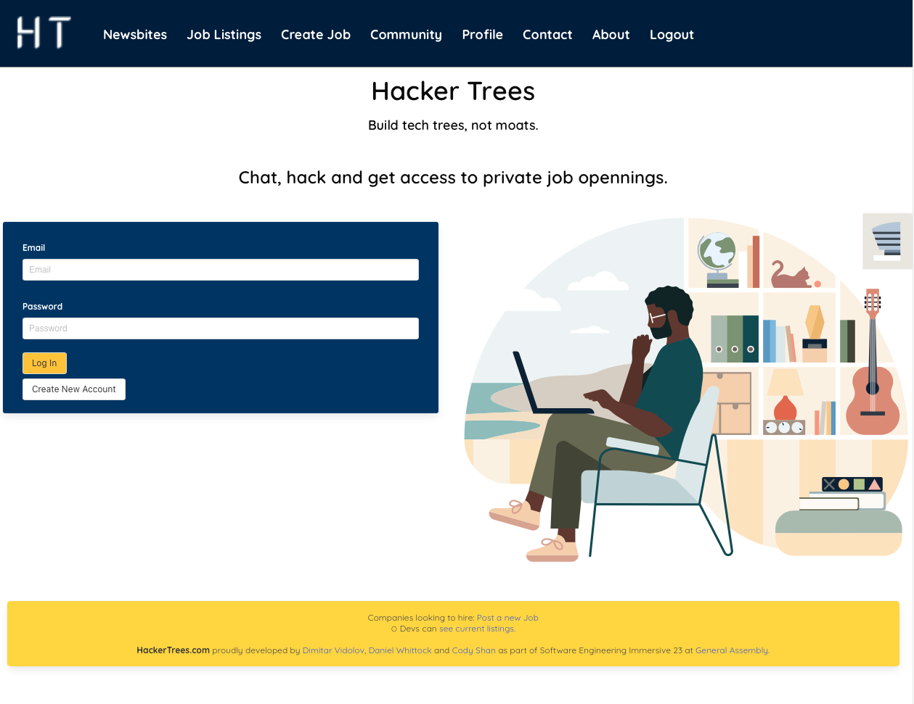
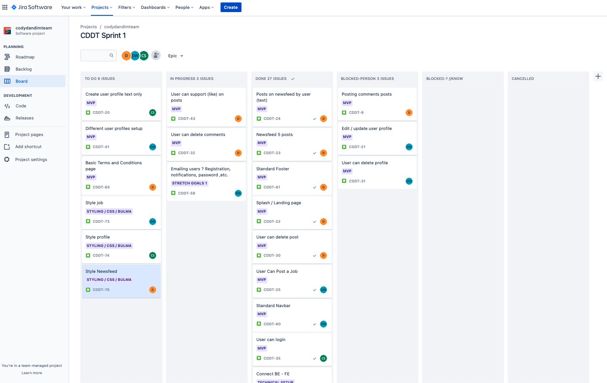

# hackertrees

## Overview

This is the third project of the software engineering immersive course at General Assembly London. The assignment was to create a full-stack website with React and Node.js. The project was to be completed **in a group** within **6 days** over 2 weeks. 

Preview: 
(navbar is shown for preview purposes, it's unavailable unless signed in)


## Technologies used 

- React
- Node.js
- Mongoose
- Express
- MongoDB
- HTML
- CSS
- JavaScript
- Git and GitHub
- Bulma

## Approach

The idea from the beginning was to create a specialised network site for IT professionals. 
My team and I wrote up user stories and wireframes using Miro:


I took the lead on the social aspect of the site, including filtering, showing and hiding comments, tags, CRUD posts and comments, both on the frontend and backend. I also contributed to the home page, the middleware on the backend, the footer, an about us page, a login, register and logout. 


## Timeline
- Day 1 - Brainstorming & wireframes, user stories, pseudo models
- Day 2 - Boilerplate setup, Git setup, Jira, the start of Sprint 1
- Day 4 - End of sprint 1, the start of Sprint 2
- Day 6 - End of sprint 2
- Day 7 - Deployment


## Jira setup 

My tickets are marked orange.

### Sprint 1:
#### MVP Roadmap


#### Initial Backlog


#### Backlog


#### Stretchgoals


#### MVP done


--------


### Sprint 2
#### Board


#### Backlog


#### Roadmap


In total, I completed 12 of 28 issues ~ 43% + initial technical installations, Git and Jira setups.

## Bugs, Wins & Learnings
Many features that were stretch goals were not finished, including a search for the whole site.
It was a great project and there are a throve of features that can be added to make it a proper product. 

Working in a team is fun and can get a lot done when the group is in sync. 
I learned quite a bit about react, router, state and Bulma on this project. 

A good idea was to keep updating the front end with a time interval:
```
  const getPostData = async () => {
    const { data } = await axios.get(`${baseUrl}/posts/`,
      {
        headers: { "authorization": `Bearer ${localStorage.getItem("token")}` },
      })
    setAllUserPosts(data)
  }

  useEffect(() => {
    getPostData()
    setInterval(() => {
      getPostData()
    }, 2000);
  }, [])
  ```

  That way the user will see up-to-date data. 
<<<<<<< HEAD
  Deleting comments and posts in real time using state also drastically improves the UX. 
=======
  Deleting comments and posts in  real-time using state also improves drastically the UX. 
>>>>>>> 90ddc1d7785e026e13dc59d67f97547b01ecf8d4
  I also added a show/hide button for the comments so the feed doesn't clutter. 

The final version of the newsfeed:


## Credits
- Logo: Dimitar Vidolov (via canva.com).
--------
